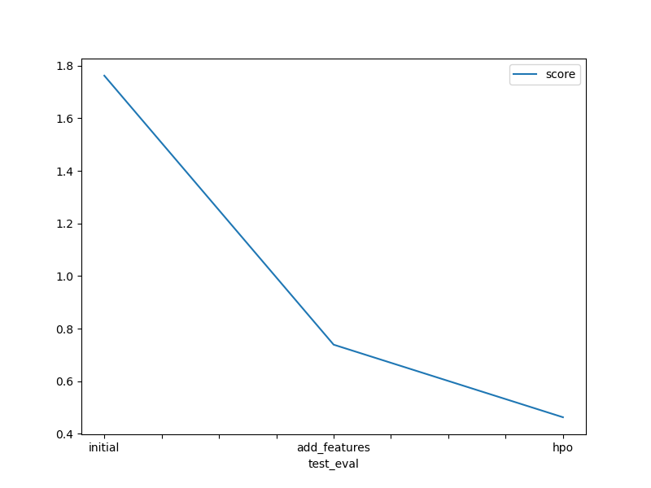

# Report: Predict Bike Sharing Demand with AutoGluon Solution
#### Daniel Pilch

## Initial Training
### What did you realize when you tried to submit your predictions? What changes were needed to the output of the predictor to submit your results?
I made the project using my own development environment. During the initial training, I encountered several problems when trying to upload my predictors. I had to download the kaggle package via pip to be able to upload my results.

### What was the top ranked model that performed?
The top-ranked models that demonstrated excellent performance were the WeightedEnsemble_L3, NeuralNetFastAI_BAG_L2, and NeuralNetFastAI_BAG_L2.

## Exploratory data analysis and feature creation
### What did the exploratory analysis find and how did you add additional features?
During EDA, I checked for missing data. The dataset was well prepared and did not need to be cleaned. I changed the date column from object type to datatime. I separated the date column into more features. I extracted the year, month, day and time from it. I also noticed that temp, atemp and humidity had a normal distribution.

### How much better did your model preform after adding additional features and why do you think that is?
With the addition of additional features such as year, month, day and time, the model has improved significantly. This is because people depending on the hour, day and month which is correlated with the season, weather and holidays has an impact on the decision whether they will rent a bike.

## Hyper parameter tuning
### How much better did your model preform after trying different hyper parameters?
The model drastically improved in prediction when additional hyperparemeters were added and modified. I was helped in selecting the hyperparameters by the autoglun documentation found [here](https://auto.gluon.ai/stable/tutorials/tabular/tabular-indepth.html#specifying-hyperparameters-and-tuning-them).

### If you were given more time with this dataset, where do you think you would spend more time?
I would examine more closely the correlation between seasons weather (temperature and humidity), hours. I would also check what days there are some holidays, days off and and add that as additional features.

### Create a table with the models you ran, the hyperparameters modified, and the kaggle score.
|model| time_limit | problem_type | num_boost_round | learning_rate | activation | score    |
|--|------------|--------------|-----------------|--------------|------------|----------|
|initial| 10*60      | default      | default         | default      | default    | 1.76179  |
|add_features| 10*60      | regression   | default         | default      | default    | 0.73922  |
|hpo| 10*60      | regression   | 10              | 0.0005             | relu       | 0.46334  |

### Create a line plot showing the top model score for the three (or more) training runs during the project.

### Create a line plot showing the top kaggle score for the three (or more) prediction submissions during the project.
    

## Summary
In this project, I used the AutoGluon solution to predict bike sharing demand. Here is a summary of the key findings and steps taken:

1. Initial Training: Initially, when I tried to submit my predictions, I realized that some changes were needed to the output of the predictor to meet the submission requirements. I made the necessary adjustments to the predictor output format.

2. Top Ranked Model: The top-ranked model that performed well was the WeightedEnsemble_L3, along with the NeuralNetFastAI_BAG_L2 and NeuralNetFastAI_BAG_L2 models.

3. Exploratory Data Analysis (EDA) and Feature Creation: During EDA, I checked for missing data and found that the dataset was well-prepared and did not require cleaning. I transformed the date column from object type to datetime and extracted additional features from it such as year, month, day, and time. I also observed that the temperature, apparent temperature, and humidity features followed a normal distribution.

4. Improved Model Performance: After adding additional features like year, month, day, and time, the model's performance improved significantly. This is because factors such as hour, day, and month, which are correlated with the season, weather, and holidays, have an impact on the bike rental decision.

5.  Hyperparameter Tuning: I experimented with different hyperparameters and found that the model's performance drastically improved. I referred to the AutoGluon documentation for guidance on specifying and tuning hyperparameters.

6.  Future Work: Given more time with the dataset, I would focus on further analyzing the correlation between seasons, weather conditions (temperature and humidity), and specific hours. Additionally, I would explore the inclusion of additional features related to holidays and days off.

7.  Summary Table: I created a summary table that includes the models I ran, the modified hyperparameters, and the Kaggle scores obtained.

8.  Line Plots: I created line plots showing the top model score for the three training runs during the project, as well as the top Kaggle score for the three prediction submissions.

Overall, by leveraging AutoGluon and performing thorough exploratory analysis and feature engineering, I was able to improve the model's performance in predicting bike sharing demand.
